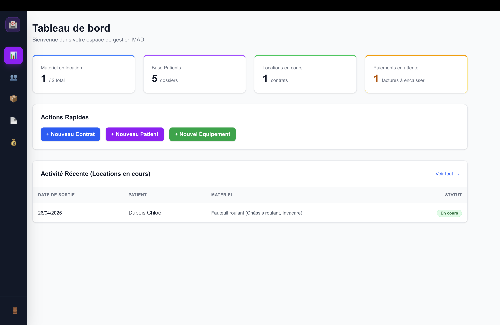
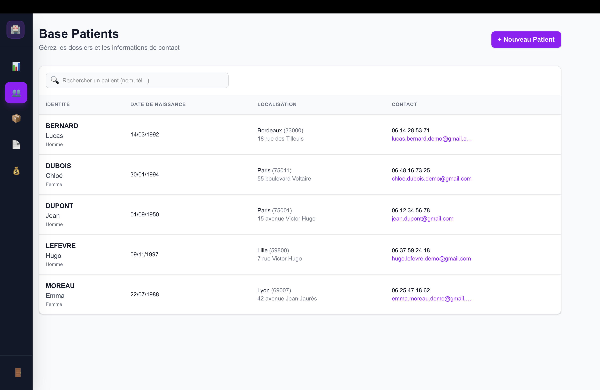
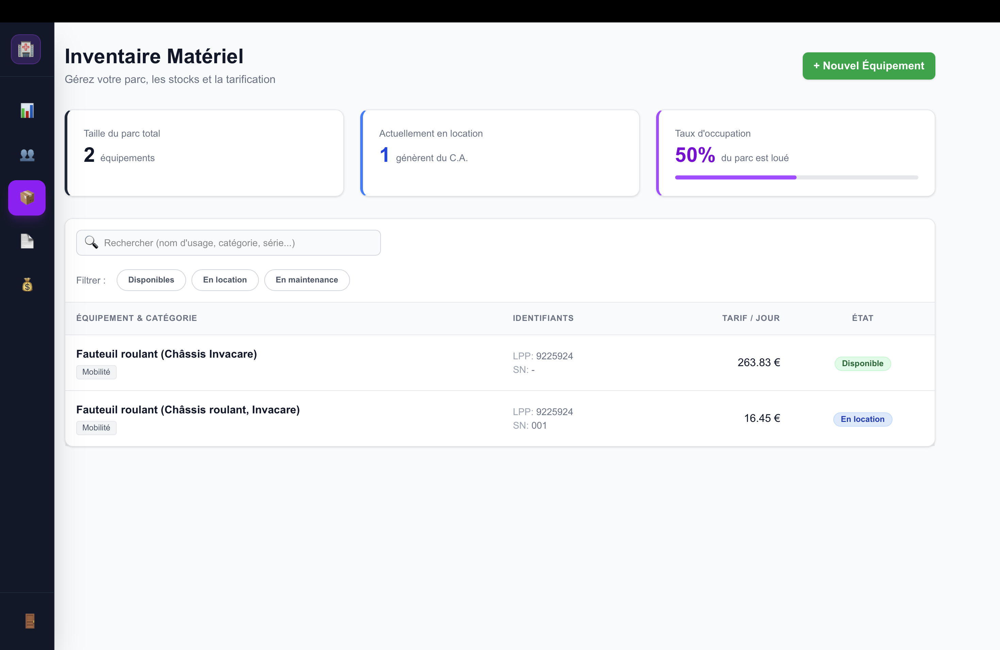

# 🏥 PharmaSaaS (SaaS pour Pharmacies)

**Lien de l'application :** [https://saa-s-pharmacie.vercel.app/](https://saa-s-pharmacie.vercel.app/)

---

### 🧪 Test & Status / Test et État du projet

> **FR : Envie de tester ?** Vous n'avez pas besoin de posséder une pharmacie ! Sentez-vous libre de créer un compte avec votre adresse e-mail personnelle pour explorer toutes les fonctionnalités en conditions réelles.
> **🚧 Note :** Le projet est actuellement en **cours de développement**. Il s'agit d'un prototype fonctionnel, mais vous pourriez rencontrer quelques bugs mineurs.
>
> **EN: Want to try it out?** You don't need to own a pharmacy! Feel free to create an account with your personal email address to test drive all the features of the SaaS.
> **🚧 Note:** This project is currently a **work in progress**. It is a functional prototype, but you may encounter some minor bugs.

---

## 📸 Aperçu de l'interface / UI Preview

| 📊 Dashboard & Statistiques | 👥 Gestion des Patients |
|---|---|
|  |  |

| 📦 Inventaire & Matériel | 📄 Facturation Premium A4 |
|---|---|
|  |  |

---

## 🇫🇷 Version Française

### 📖 À propos du projet
PharmaSaaS est une plateforme de gestion moderne conçue pour aider les officines à administrer la location de leur matériel médical. L'objectif est de digitaliser la création de contrats, le suivi de l'inventaire et la gestion des patients via une interface ergonomique.

### ✨ Fonctionnalités Principales
* **🔐 Authentification Hybride** : Connexion par email pour le gérant et par identifiant simplifié pour l'équipe officinale.
* **👥 Gestion des Patients** : Création de dossiers patients simplifiée (conforme RGPD/Données de santé allégées).
* **🛏️ Inventaire Dynamique** : 
  * Support des codes officiels LPP.
  * "Noms d'usage" personnalisés pour une identification rapide (ex: *Tire-lait n°1*).
  * Suivi des états : *Disponible*, *En location*, *En maintenance*.
* **📄 Création de Contrats** : Tunnel de location fluide liant patient, matériel et frais d'installation.
* **📱 Interface Responsive** : Menu latéral (Sidebar) optimisé pour le tactile et mode sombre premium.

### 🛠️ Stack Technique
* **Frontend** : Next.js 15 (App Router), Tailwind CSS
* **Backend** : Supabase (PostgreSQL, Auth)
* **Déploiement** : Vercel

---

## 🇺🇸 English Version

### 📖 Project Overview
PharmaSaaS is a modern management platform built to help pharmacies manage medical equipment rentals. It digitizes contract creation, inventory tracking, and patient management through a streamlined, user-friendly interface.

### ✨ Key Features
* **🔐 Hybrid Authentication**: Email-based login for managers and simplified ID-based login for pharmacy staff.
* **👥 Patient Management**: Simplified patient record creation (GDPR-friendly/minimal health data).
* **🛏️ Dynamic Inventory**:
  * Official LPP code support.
  * Custom "Display Names" for quick equipment identification (e.g., *Breast Pump #1*).
  * Status tracking: *Available*, *On Rent*, *In Maintenance*.
* **📄 Contract Management**: Seamless rental workflow linking patients, equipment, and installation fees.
* **📱 Responsive Interface**: Touch-optimized Sidebar and premium Dark Mode theme.

### 🛠️ Tech Stack
* **Frontend**: Next.js 15 (App Router), Tailwind CSS
* **Backend**: Supabase (PostgreSQL, Auth)
* **Deployment**: Vercel
